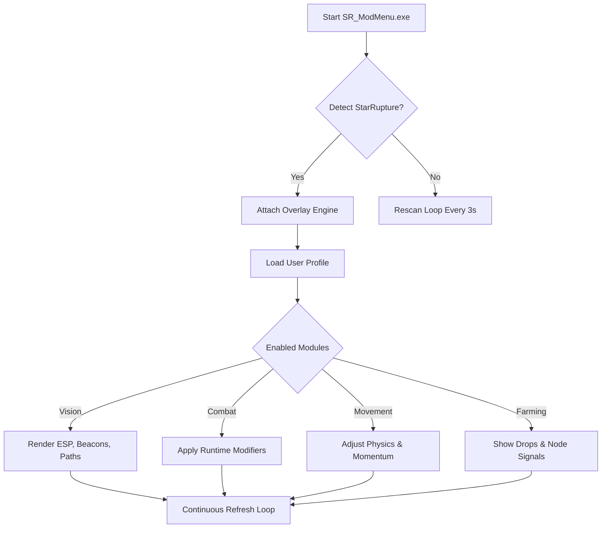

## Overview — A Lantern for Wanderers

The **StarRupture Mod Menu** is a modular overlay that slips atop the game, offering quick-toggles, sliders, and profiles you can summon mid-leap, mid-sprint, mid-chaos. It leans toward flow: not to break the game’s fabric, but to help you *read* it more clearly.

> [!NOTE]
> The Mod Menu uses a low-latency render path designed for stability in large anomaly clusters.


## Features — A Chorus of Hidden Switches

### 👁 Vision & ESP Resonance

* Entity silhouettes with soft-color gradients
* Elite / anomaly identification bands
* Loot-beacon shimmer based on rarity
* Traversal-path echoes revealing climbable geometry
* Hazard pulse for unstable cosmic zones

### ⚔️ Combat & Flow Dynamics

* Precision damage wheel: 1.05×–1.70×
* Cooldown drift tuner for smooth skill cycling
* Recoil restabilization for ranged builds
* Threat arcs showing enemy intent lines
* Adaptive-speed harmonics during burst phases

### 🌌 Traversal & Kinetic Shaping

* Dash augmentation (5–40% range)
* Gravity easing for smoother aerial transitions
* Slide stabilizer and momentum carryover
* Hover-drift tuning in low-grav fields

### 💠 Loot, Farming & Cosmic Yield Tools

* Multi-tier drop radar (distance + rarity)
* Auto-pulse signals for mythic drops
* Resource node highlighter
* Pickup magnet radius adjustments

---

## Setup — Awakening the Menu ⚡

1. Extract the archive to a preferred folder.
2. Launch `SR_ModMenu.exe` **as Administrator**.
3. Start **StarRupture**.
4. When the console whispers:

   ```
   Status: Attached ✔
   ```

   you’re ready.
5. Open the menu:

   ```
   Ctrl + Backspace
   ```
6. Enable modules or load a crafted profile.

### Optional CLI Start

```bash
SR_ModMenu.exe --profile Riftseer --noSound
```

> [!WARNING]
> Disable GPU overlays (Steam FPS counter, Rivatuner) if you see UI flicker.

---

## Compatibility — A Stable Orbit

| Platform             | Support | Notes                   |
| -------------------- | ------- | ----------------------- |
| Windows 10           | ✔       | Stable hooks            |
| Windows 11           | ✔       | Preferred environment   |
| Steam Build          | ✔       | Auto-detection          |
| Borderless Window    | ✔       | Optimal overlay clarity |
| Fullscreen Exclusive | ⚠       | Uses fallback renderer  |

**Accessibility:** Every outline, glow, and radius can be customized for visibility and comfort.

---

## Advanced Configuration — Write Your Own Star-Script 📜

All profiles live within `/profiles/`.

### Example: **Riftseer.json**

```json
{
  "name": "Riftseer",
  "vision": {
    "entityESP": true,
    "eliteColor": "violet",
    "lootBeacon": true,
    "pathEcho": true,
    "hazardPulse": true,
    "opacity": 0.82
  },
  "combat": {
    "damageScale": 1.25,
    "cooldownShift": 0.22,
    "recoilEase": true,
    "threatLines": true
  },
  "movement": {
    "dashBoost": 0.20,
    "gravityEase": 0.15,
    "momentumCarry": true
  },
  "farming": {
    "dropRadar": true,
    "radius": 75,
    "rarityMinimum": "Epic",
    "autoPulse": true
  },
  "ui": {
    "scale": 1.1,
    "theme": "lunar-minimal"
  },
  "keys": {
    "toggleVision": "F4",
    "toggleCombat": "F5",
    "toggleFarming": "F6",
    "toggleMovement": "F7",
    "panicReset": "Ctrl+F12"
  }
}
```

### Profile Crafting Advice

* Exploration presets thrive with **pathEcho + hazardPulse**.
* Loot-heavy runs pair well with **dropRadar 60–90** and mild cooldown reduction.
* Bossing profiles should tone down ESP but raise **recoilEase + damageScale**.
* Keep `panicReset` close—it restores pure vanilla physics instantly.

---

## System Logic — How the Menu Thinks



---

## Quick Module Matrix

| Module          | Purpose   | Adjustable                |
| --------------- | --------- | ------------------------- |
| ESP Vision      | Awareness | Color, thickness, opacity |
| Combat Wheel    | Pacing    | 1.05×–1.70×               |
| Traversal Boost | Mobility  | % values                  |
| Drop Radar      | Looting   | Radius + rarity           |
| Menu UI         | Comfort   | Themes + scale            |

---

## FAQ — Whispered Answers in the Dark 🌫

**❓ Does the Mod Menu touch installation files?**
No—everything is runtime-only.

**❓ Can it run with a controller?**
Yes. Controller chords (e.g., LT + D-Pad Up) can trigger menu toggles.

**❓ Is auto-updating supported?**
A lightweight offset scanner attempts to align with new patches, and warns when manual updates are needed.

**❓ Does it affect save integrity?**
Not at all. Saves remain untouched and authentic.

**❓ Can I run multiple profiles?**
Yes—switch mid-session without reloading the game.

---

## Final Thoughts — Wander the Broken Stars with Sight

**StarRupture** is a symphony of wreckage and wonder, a place where silence glows.
This Mod Menu doesn’t seek to overpower your journey—it seeks to *brighten* it: to give your boots more certainty, your eyes more truth, your strikes more rhythm, and your nights more luminous direction.

If you wish the world would speak a little clearer, this framework is the voice you’ve been waiting for.

---
